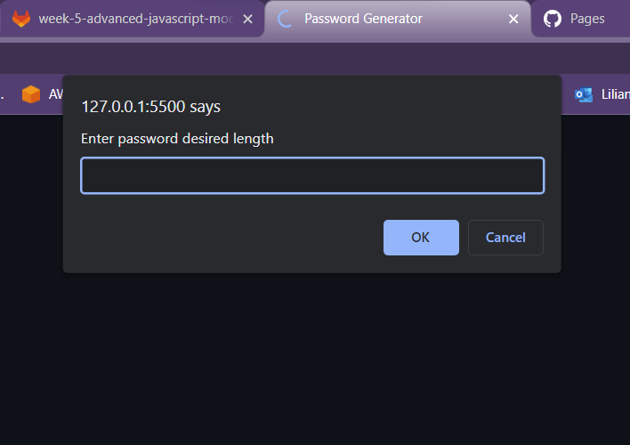
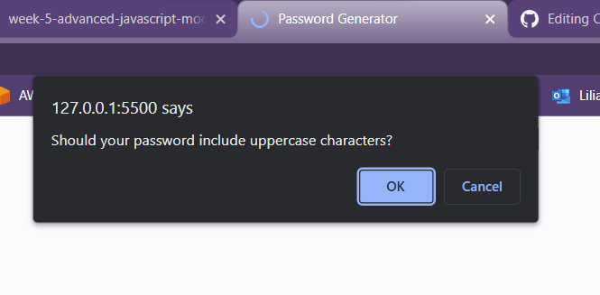
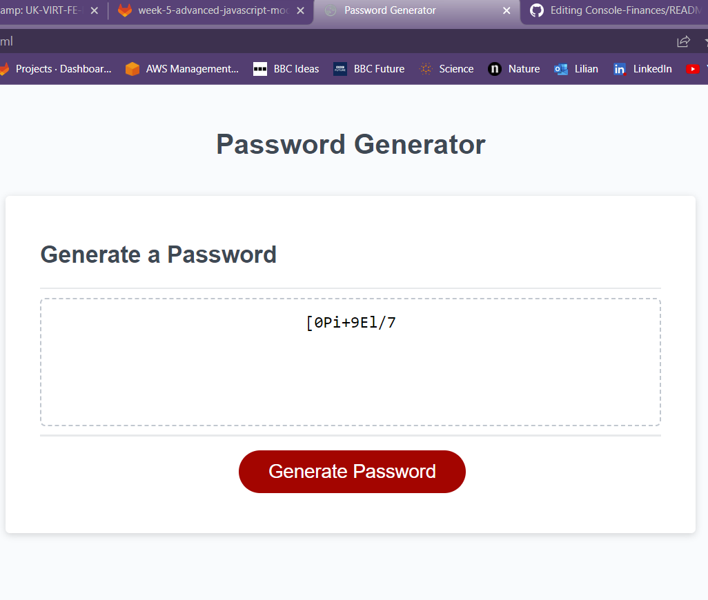

# Module `5` Challenge: Password Generator

## Overview
The password generator is an web application that can be used by an employee (or anyone else) to generate a random password based on criteria they’ve selected

The user generating the password can chose the lenght of the password, as well as the type of characters the password will include.

This app runs in the browser, and will feature dynamically updated HTML and CSS powered by JavaScript code.

### Deployment

The app was deployed using Github Pages and can be accessed [here](https://ortizlilian.github.io/password-generator/).

## Mockups

When the app is loaded the user gets to anwers the following prompt:

After the user has set the number of characters of the password, he needs to decided what types of characters the password will include. This is how a confirm prompt looks like:

Finally, the user clicks on the generate password button and the box in the middle of the page shows the password:

### Acceptance Criteria

